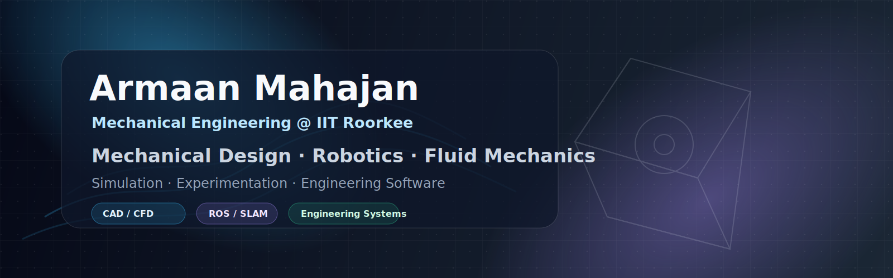

 

## Hi, I'm Armaan

I'm a Mechanical Engineering undergraduate at IIT Roorkee. I enjoy working on engineering problems where design, simulation, experimentation, and code meet: autonomous systems, CAD-driven workflows, robotics, and fluid mechanics.

My recent work includes building an autonomous vehicle stack in ROS and Gazebo, designing wind-tunnel experiments for controlled turbulence and active flow control, and contributing to ML-assisted CAD and drafting automation for manufacturing applications.

## Selected Work

### Autonomous Vehicle Simulation & Hardware Design

Worked with **IIT Roorkee Motorsports x Data Science Group** on a simulated autonomous ground vehicle and its hardware integration.

- Developed a perception-planning-control pipeline in ROS and Gazebo
- Trained an object detection model with **0.848 mAP** on the FSOCO dataset
- Designed a discretized-environment SLAM framework for structured tracks
- Implemented lateral and longitudinal controllers for closed-loop navigation
- Contributed to proof-of-concept components for mounting, packaging, and actuation

### Active Grid for Controlled Turbulent Flow

Designed a modular active grid for wind-tunnel studies under **Prof. Sushanta Dutta** at IIT Roorkee.

- Built parametric CAD models of rotating winglets
- Studied blockage, flow uniformity, wake interaction, and shear-layer development
- Used CFD simulations to evaluate geometric and actuation configurations

### Active Flow Control of a Bluff Body

Working on an experimental setup to study drag reduction using synchronized jet actuation.

- Fabricated a modular model with an integrated jet-injection mechanism
- Using PIV and CFD to study wake behavior and reattachment

### Multi-Actuator Quadrupedal Robot

Designed a multi-actuator leg architecture with emphasis on backdrivability, impact tolerance, and iterative mechanical evaluation.

## Experience

### ML Intern, Manufacturing Design Automation | Hanomi AI

- Translated engineer-defined design rules and manufacturing constraints into structured workflows for ML-assisted CAD and drafting automation
- Built preprocessing and algorithmic pipelines for engineering and manufacturing data
- Worked with mechanical and design engineers on CAD constraints, design intent, drafting requirements, and manufacturability

## Tools I Use

**Programming:** Python, C++, MATLAB 
**Engineering:** SolidWorks, ANSYS Fluent, Simulink 
**Robotics & ML:** ROS, Gazebo, OpenCV, PyTorch, Ultralytics

## A Practical Side Project

I also built a [dashboard for IIT Roorkee's Debating Society](https://armaanm77.github.io/Debsoc_Dashboard_App/) to support real operational use: records, tournament data, and society analytics.

---

  Mechanical engineering, robotics, simulation, and useful software.

