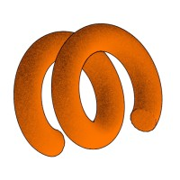

 

## About Me

I'm a Mechanical Engineering undergraduate at **IIT Roorkee**, interested in building systems where mechanical design, simulation, experimentation, and code work together.

- Autonomous Engineer for **[IIT Roorkee Motorsports x Data Science Group](https://github.com/DSGxRMS)**
- Working on autonomous navigation, perception, SLAM, and hardware integration
- Exploring fluid mechanics through CFD, PIV, wind-tunnel experiments, and active flow control
- Building CAD-driven workflows for robotics and manufacturing applications

## DSG x RMS

I contribute to the autonomous vehicle program built by **[IIT Roorkee Motorsports x Data Science Group](https://github.com/DSGxRMS)**. My work focuses on perception, SLAM, autonomous navigation, and hardware integration for the team's ground-vehicle stack. Some of this work lives in the **[DSGxRMS organization](https://github.com/DSGxRMS)** rather than in repositories under my personal account.

## Featured Projects

<table>
<tr>
<td width="50%" valign="top">

### [RAMS-e-25](https://github.com/DSGxRMS/RAMS-e-25)

Autonomous ground-vehicle stack developed with **IIT Roorkee Motorsports x Data Science Group**.

- Perception-planning-control pipeline in ROS and Gazebo
- Object detection with **0.848 mAP**, structured-track SLAM, and closed-loop navigation

</td>
<td width="50%" valign="top">

### [Active Flow Control Using a Synchronised Jet](https://github.com/ArmaanM77/Active-Flow-Control-Mechanism-for-a-Bluff-Body-Using-a-Synchronised-Jet)

Experimental and computational study of drag reduction through synchronized jet actuation on a bluff-body wake.

- Modular test model with integrated jet injection
- PIV-based characterization with CFD validation and wake-reattachment analysis

</td>
</tr>
<tr>
<td width="50%" valign="top">

### [Multi-Actuator Quadrupedal Robot](https://github.com/ArmaanM77/Multi-Actuator-Quadrupedal-Robot)

Mechanical design of a multi-actuator leg architecture with emphasis on backdrivability and impact tolerance.

- Parametric CAD assemblies
- Kinematic layout, joint configuration, and iterative actuator-placement evaluation

</td>
<td width="50%" valign="top">

### [DebSoc Dashboard](https://armaanm77.github.io/Debsoc_Dashboard_App/)

A functional web dashboard built for the day-to-day operations of **IIT Roorkee's Debating Society**.

- Debate, speaker, adjudicator, and tournament records
- Motion archives, participation analytics, and a single operational view for society data

</td>
</tr>
</table>

## Research & Engineering

<table>
<tr>
<td width="15%" align="center" valign="middle">
  
</td>
<td width="85%" valign="top">

### Active Grid for Controlled Turbulent Flow | IIT Roorkee

Designed a modular active grid for wind-tunnel studies under **Prof. Sushanta Dutta**. Built parametric CAD models of rotating winglets and used CFD to study blockage, flow uniformity, wake interaction, and shear-layer development.

</td>
</tr>
<tr>
<td width="15%" align="center" valign="middle">
  
</td>
<td width="85%" valign="top">

### Manufacturing Design Automation | Hanomi AI

Worked on ML-assisted CAD and drafting automation for manufacturing applications. Translated engineer-defined design rules and production constraints into structured preprocessing and algorithmic workflows.

</td>
</tr>
</table>

## Languages & Tools

### Programming

### Robotics, ML & Engineering

 
 

## GitHub Profile

  <strong>Somewhere between first principles and controlled chaos, the machine comes alive.</strong>

